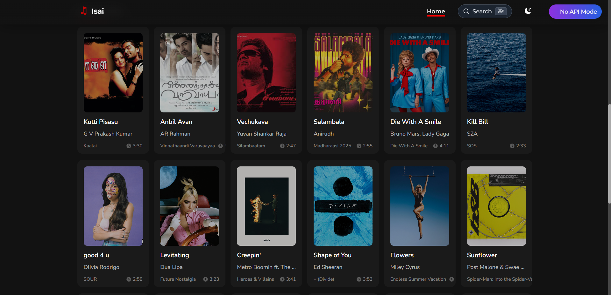

<div align="center" >
  <br/>
  <br/>
  
  <h1>NextSound</h1>
  <br/>

  <p >
A music discovery app built with React and TypeScript. <br/> Browse tracks, albums, and artists using Spotify's API.
  </p>
</div>

<br/>
<br/>

## Features

### 🎵 Music Discovery & Playback
- **Smart Audio Player**: Full-featured music player with play/pause, seek, volume control
- **Queue Management**: Add tracks to queue, reorder, remove, and manage playback order
- **Mini Player**: Persistent mini player that stays accessible while browsing
- **Playback Controls**: Shuffle, repeat (off/one/all), skip previous/next
- **Track Information**: Display album artwork, artist names, track duration, and metadata

### 🔍 Search & Navigation
- **Command Palette**: Powerful search interface (⌘+K / Ctrl+K) for quick navigation
- **Real-time Search**: Search tracks, albums, and artists with live results
- **Keyboard Shortcuts**: Full keyboard navigation support
- **Smart Recommendations**: Context-aware suggestions and recent items

### 🎨 User Interface
- **Responsive Design**: Optimized for desktop, tablet, and mobile devices
- **Dark/Light Themes**: Multiple theme options with smooth transitions
- **Modern UI Components**: Built with Radix UI and Tailwind CSS
- **Smooth Animations**: Framer Motion powered transitions and micro-interactions
- **Accessibility**: Full keyboard navigation and screen reader support

### 🚀 Performance & Developer Experience
- **TypeScript**: Full type safety throughout the application
- **State Management**: Redux Toolkit with RTK Query for efficient data fetching
- **Testing**: Comprehensive test suite with Vitest and Playwright
- **Mock Service Worker**: Offline-first development with realistic API mocking
- **Hot Reload**: Fast development with Vite's lightning-fast HMR

## How it works

NextSound runs in two modes depending on your setup:

### Demo mode (no API needed)
Without API credentials:
- Curated collection of 2024-2025 chart toppers
- Works immediately after `git clone` and `npm install`
- Real album artwork and track metadata
- Features artists like Billie Eilish, Harry Styles, Morgan Wallen, and more

Benefits:
- Perfect for trying out the app quickly
- No API setup required
- Images load from Spotify CDN
- Shows off the full UI including queue system and command palette

<br/>


### With Spotify API (recommended)
If you have Spotify API credentials:
- Real-time access to Spotify's music catalog
- Search across millions of tracks, albums, and artists
- Latest trending songs and new releases
- All features available including live search and recommendations

Requires:
- Spotify API credentials in `.env` file
- Backend server running for CORS handling

<br/>


The app automatically detects which mode to use.

<br/>

## 🎹 Keyboard Shortcuts

NextSound includes powerful keyboard shortcuts for efficient navigation:

- **⌘+K / Ctrl+K**: Open command palette for quick search and navigation
- **⌘+D / Ctrl+D**: Toggle between dark and light themes
- **Space**: Play/pause current track (when audio player is focused)
- **← / →**: Skip to previous/next track
- **↑ / ↓**: Adjust volume
- **ESC**: Close command palette or any open modal

## 🎵 Using the Queue System

The queue system allows you to manage your music playback:

- **Add to Queue**: Click the "+" button on any track to add it to your queue
- **Queue Panel**: Access your queue from the sidebar or mini player
- **Reorder Tracks**: Drag and drop tracks in the queue to reorder them
- **Remove Tracks**: Click the "×" button to remove tracks from the queue
- **Shuffle & Repeat**: Use the shuffle and repeat controls in the mini player

## :camera: Screenshots

### Hero Section 
<kbd></kbd>

<br/>

### Homepage
<kbd></kbd>


<br/>
<br/>

## Getting started

You need Node.js 18+ and npm.

```bash
# Clone and install
git clone https://github.com/natashaongiscoding/music-app.git
cd music-app
npm install

# Start the app
npm run dev
```

Open `http://localhost:5173` - the app works immediately with demo data.

<br>

### Want live Spotify data?

1. Create a [Spotify Developer Account](https://developer.spotify.com/) and create a new app
2. Get your Client ID and Client Secret from the app dashboard
3. Create a `.env` file in the root directory:
   ```bash
   # On Windows (PowerShell)
   New-Item -Path .env -ItemType File
   
   # On macOS/Linux
   touch .env
   ```
4. Add your credentials to `.env`:
   ```env
   VITE_SPOTIFY_CLIENT_ID=your_client_id_here
   VITE_SPOTIFY_CLIENT_SECRET=your_client_secret_here
   ```
5. Start with the backend:
   ```bash
   npm run dev:full
   ```

<br/>

## Testing

```bash
# Run tests
npm test

# Run with coverage
npm run test:coverage
```

<br/>

## Build

```bash
npm run build
npm run preview
```

<br/>

## Tech Stack

- **Frontend:** React 18, TypeScript, Vite, Tailwind CSS
- **State:** Redux Toolkit with RTK Query
- **Routing:** React Router v6
- **Animations:** Framer Motion
- **Backend:** Node.js, Express.js (CORS proxy)
- **API:** Spotify Web API
- **Testing:** Vitest, Playwright

<br>

## Troubleshooting

### Common Issues

**CORS Errors with Spotify API**
- **Problem:** API requests fail due to CORS restrictions
- **Solution:** Ensure the backend server is running (`npm run dev:full` or `npm run server:dev`)
- **Details:** Spotify Web API cannot be called directly from browsers due to CORS policy

**Missing Environment Variables**
- **Problem:** App shows "No music data available" or API errors
- **Solution:** Check that `.env` file exists with valid Spotify credentials
- **Reference:** Follow the "Want live Spotify data?" section above for setup guidance

**Port Conflicts**
- **Frontend (Port 5173):** Check if another Vite/dev server is running
- **Backend (Port 3001):** Check if another Express server is using the port
- **Solution:** Kill existing processes or modify port configuration

**Build/TypeScript Errors**
- **Problem:** TypeScript compilation errors during build
- **Solution:** Run `npm run build` to see specific error details
- **Common fix:** Ensure all dependencies are installed (`npm install`)

<br/>

### Getting Help
- Follow the setup instructions in the "Want live Spotify data?" section above
- [Reach out to the NextWork community to ask your question!](https://community.nextwork.org/c/i-have-a-question/)

---

<div align="center">
  <p>Built with ❤️ for music lovers everywhere</p>
  <p>Discover your next favorite track with NextSound</p>
</div>
